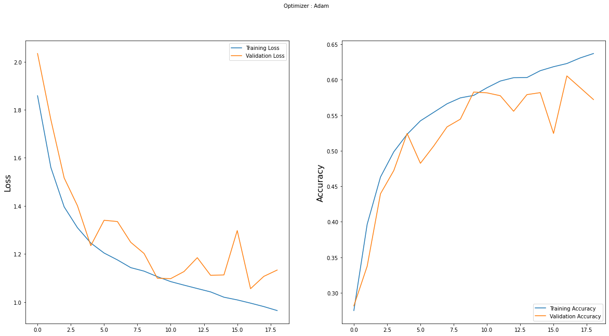

## Introduction:
Here I have built a real time face emotion recognition training model and application to detect emotions of a person using a camera. The model was trained on [FER-2013](https://www.kaggle.com/msambare/fer2013) dataset which had a total of 35887 grayscale, 48x48 sized face images with seven emotions - angry, disgust, fear, happy, neutral, sad and surprise. Custom built Convolutional Neural Network architecture was used to train the model.


The model gave an accuracy of 63% for training set and 60% accuracy for test set. A web application was built and deployed on Streamlit cloud using streamlit API.



# How to run locally:

To run the script you must have python or [anaconda](https://www.anaconda.com/products/individual) installed. After installation open 'anaconda prompt'

* First, clone the repository and enter the folder

```
git clone https://github.com/PuroshotamSingh/Face-Emotion-Recognition.git
cd Face-Emotion-Recognition
```

* Download the FER-2013 dataset from [here](https://www.kaggle.com/msambare/fer2013)

* Install the dependencies
    `pip install -r requirements.txt`
    
* run the webcam
    `python Face_Emotion_Recognition_Testing.py`

# Check out the deployed app:

Streamlit cloud - https://share.streamlit.io/puroshotamsingh/face-emotion-recognition/main/app.py

Note - It might take few minutes to load when opening first time. After few minutes reload the page and it should be up running.
I only have free account and less compute resources so the app might be slow.

## References

* "Challenges in Representation Learning: A report on three machine learning contests." I Goodfellow, D Erhan, PL Carrier, A Courville, M Mirza, B
   Hamner, W Cukierski, Y Tang, DH Lee, Y Zhou, C Ramaiah, F Feng, R Li,  
   X Wang, D Athanasakis, J Shawe-Taylor, M Milakov, J Park, R Ionescu,
   M Popescu, C Grozea, J Bergstra, J Xie, L Romaszko, B Xu, Z Chuang, and
   Y. Bengio. arXiv 2013.
